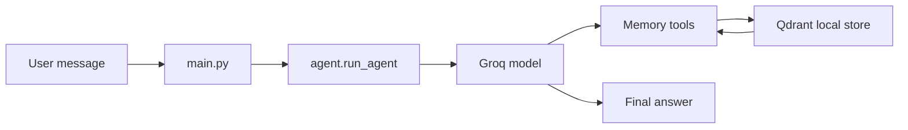

# simple-langchain-agent

A simple LangChain agent with short-term chat memory and persistent long-term memory.

The agent uses Groq for the LLM, LangGraph for conversation state, and Qdrant for vector-based long-term memory. Important user facts can be saved, retrieved later, and reused across future conversations.

## Features

- Conversational LangChain agent powered by `ChatGroq`
- Short-term memory through LangGraph's in-memory checkpointer
- Persistent long-term memory stored locally in Qdrant
- Tool-based memory workflow with `save_memory` and `search_memory`
- Interactive terminal chat loop

## How It Works



- Short-term memory keeps the current conversation context during the running process.
- Long-term memory stores durable user facts such as name, preferences, goals, and projects.
- The agent should call `save_memory` when it learns something worth remembering.
- The agent should call `search_memory` when a new question may depend on prior user context.

## Project Structure

- `main.py` - terminal chat entry point
- `agent/agent.py` - creates and runs the LangChain agent
- `agent/tools.py` - memory tools exposed to the agent
- `agent/memory.py` - Qdrant-backed long-term memory implementation
- `agent/prompts.py` - system prompt and memory rules
- `utils/config.py` - environment loading and API key validation
- `qdrant_data/` - local persistent Qdrant storage

## Requirements

- Python 3.10 or newer
- A Groq API key

## Setup

1. Create and activate a virtual environment.
2. Install dependencies:

   ```bash
   pip install -r requirements.txt
   ```

3. Create a `.env` file in the project root with your Groq key:

   ```env
   GROQ_API_KEY=your_groq_api_key_here
   ```

4. Run the agent:

   ```bash
   python main.py
   ```

## Usage

When the app starts, type messages directly into the terminal.

```text
You: remember that I am learning Python
Agent: I’ll remember that you’re learning Python.

You: what should I focus on next?
Agent: Based on what you told me earlier, ...
```

Type `exit` to stop the session.

## Long-Term Memory

Long-term memory is persisted in the local `qdrant_data/` directory.

The memory tool stores payloads like:

- `user_id`
- `memory`

This means remembered facts remain available after the process ends, as long as the Qdrant data directory is kept.

## Memory Rules

The agent is configured to:

- save durable facts only
- avoid storing greetings or temporary chat messages
- search memory when prior context matters
- never invent memories

## Configuration Notes

- `main.py` currently uses a fixed `user_id` of `user_1`.
- `agent/agent.py` currently uses the Groq model `llama-3.3-70b-versatile`.
- Short-term memory is in-process only, so it resets when the program restarts.

## Troubleshooting

- If startup fails with `GROQ_API_KEY is missing`, check your `.env` file.
- If Qdrant data appears empty, make sure the `qdrant_data/` directory is still present.
- If the agent does not remember prior facts, confirm the user ID is unchanged between runs.

## Next Steps

- Replace the fixed `user_id` with real user authentication.
- Add a web UI or API wrapper around `run_agent`.
- Add tests for memory storage and retrieval behavior.
